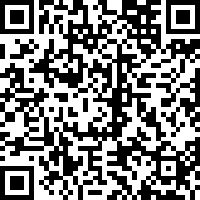

# 太平洋网络-微信JS-SDK
  

[微信JS-SDK](http://mp.weixin.qq.com/wiki/7/aaa137b55fb2e0456bf8dd9148dd613f.html)是微信公众平台面向网页开发者提供的基于微信内的网页开发工具包。通过使用微信JS-SDK，网页开发者可借助微信高效地使用拍照、选图、语音、位置等手机系统的能力，同时可以直接使用微信分享、扫一扫、卡券、支付等微信特有的能力，为微信用户提供更优质的网页体验。

根据微信JS-SDK官方的使用步骤，并针对我们公司【太平洋网络】现有的六网公众账号，统一封装了一个较为简单的公共接口【六网均可使用】。

## 快速使用

使用之前必须先引用wxApi.min.js
```html
<script src="./src/wxApi.min.js" charset="utf-8"></script>
```
### 1、简单使用自定义分享功能
```html
<script type="text/javascript">
wxApi.init(function () {
	var shareData = {
		title: "太平洋电脑网_中国第一专业IT门户网站",
		desc: "太平洋电脑网是专业IT门户网站。",
		link: "http://g.pconline.com.cn/",
		imgUrl: "http://www1.pconline.com.cn/wap/2013/cms/img/logo.png"
	};
	wx.onMenuShareAppMessage(shareData);// 分享给朋友
	wx.onMenuShareTimeline(shareData);// 分享到朋友圈
	wx.onMenuShareQQ(shareData);// 分享到QQ
	wx.onMenuShareWeibo(shareData);// 分享到微博
});
</script>
```
### 2、其他拓展功能
请参考下面的DEMO

可以用微信的扫一扫功能来打开下面的二维码体验

[太平洋电脑网](http://www1.pconline.com.cn/wap/20150116/wxapi/index.html)|[太平洋汽车网](http://www1.pcauto.com.cn/wap/20150116/wxapi/index.html)|[太平洋时尚网](http://www1.pclady.com.cn/wap/20150116/wxapi/index.html)
---|---|---
||

[太平洋亲子网](http://www1.pcbaby.com.cn/wap/20150116/wxapi/index.html)|[太平洋家居网](http://www1.pchouse.com.cn/wap/20150116/wxapi/index.html)|[太平洋游戏网](http://www1.pcgames.com.cn/wap/20150116/wxapi/index.html)
---|---|---
||

## 常见问题

### 1、注意
用了微信JS-SDK代码之后，必须把页面上传到六网主域【.pconline.com.cn】【.pcauto.com.cn】【.pclady.com.cn】【.pcbaby.com.cn】【.pcgames.com.cn】【.pchouse.com.cn】才会起作用，用本机ip地址在微信的webview上打开是不行的哦。

### 2、用了这个API怎么没生效？
可能您的微信版本不是最新的，请到APPSTORE或者各大安卓市场下载最新的微信版本。

Android 自定义分享接口需升级至 6.0.2.58 版本及以上。IOS需升级至 6.1 版本及以上。

升级到最新版本之后，如果还没生效，请先回到这里，扫描上面的二维码Demo，首先验证Demo是否能运行正确；然后再参照demo调整自己的代码：

- 页面是否有上传到六网域名地址？
- wxApi.js路径是否引用正确？
- WeixinApi.ready是否正确执行了？（可以在里面加一个alert，简单粗暴可依赖）
- 如果依然有问题，请联系我。

### 3、如果想兼容旧版本该怎么做？
目前官方已经出了这个正式版本的SDK，旧版微信虽然也有一些相关的API接口，但比较混乱，因此，我们建议是不做兼容，呼吁大家还是尽早升级到最新版本来，这对大家来说是好事，以后出什么问题，官方渠道应该都会第一时间给出解决方案，稳定很多，也不至于经常被黑。

如果非要兼容的话，可用以下方案：【不保证稳定性】

- 用UA判断微信的webview版本
- 微信版本如果大于6.1则使用本接口
- 微信版本如果小于6.1则使用旧版接口
- 旧版可参考使用@Alien封装好的接口 [https://github.com/zxlie/WeixinApi](https://github.com/zxlie/WeixinApi)